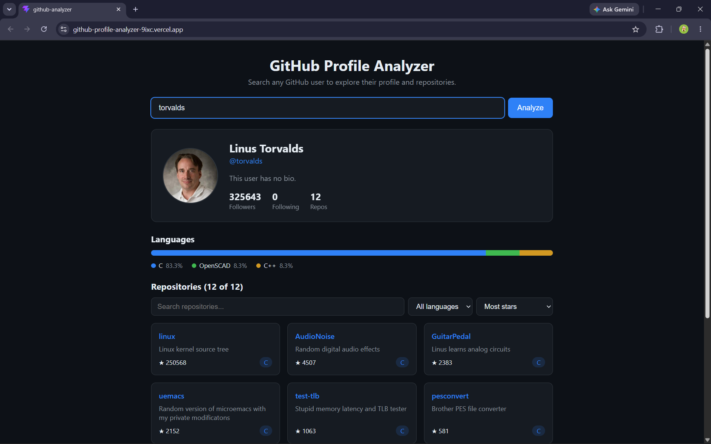
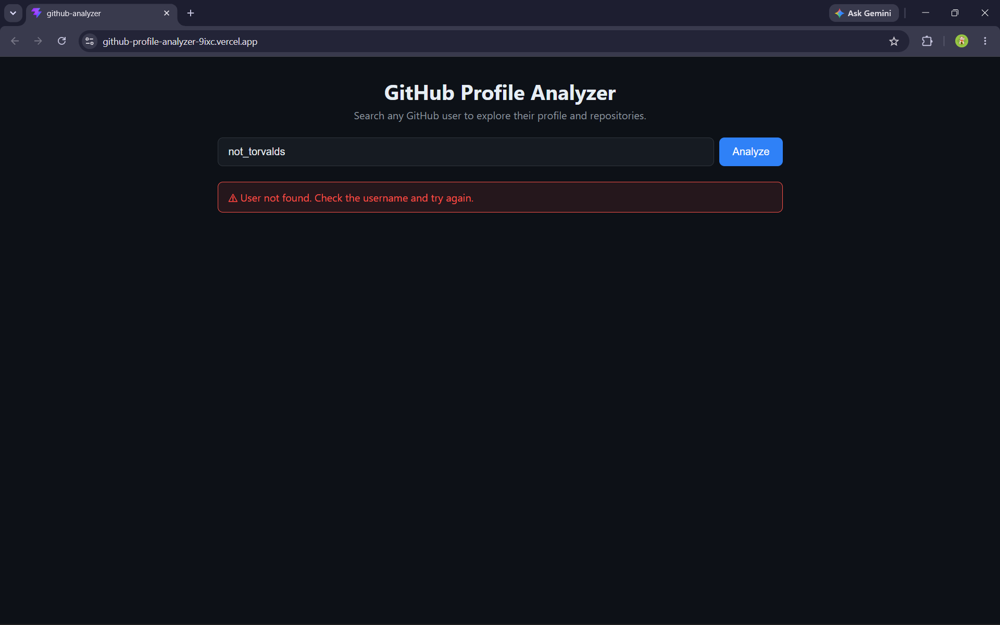

# GitHub Profile Analyzer

A responsive dashboard that lets you search any GitHub username and explore the developer's public profile, repositories, and language breakdown, using live data from the GitHub REST API.

**Live demo:** (https://github-profile-analyzer-9ixc.vercel.app/)



## Features

- Search any GitHub username
- Profile card with avatar, name, bio, followers, following, and repo count
- Public repositories with name, description, stars, and language
- Filter repositories by name, filter by language, and sort by stars, last updated, or name
- Language breakdown bar showing the share of repos per language
- Loading spinner while data is fetched
- Clear error messages for invalid usernames, empty input, network failures, and API rate limits
- Friendly message for users with no public repositories
- Responsive layout that works from phones to desktops
- Dark theme



## Tech Stack

- React (Vite)
- Plain CSS
- GitHub REST API (`/users/{username}` and `/users/{username}/repos`)

## Run Locally

```bash
git clone https://github.com/OC2427/github-profile-analyzer.git
cd github-profile-analyzer
npm install
npm run dev
```

Then open the local URL shown in the terminal.

Optional: create a `.env` file with `VITE_GITHUB_TOKEN=your_token` to raise the API rate limit. A token with no scopes is enough for public data.

## Project Structure

```
src/
  api/github.js            API calls and error handling
  components/
    SearchBar.jsx
    ProfileCard.jsx
    RepoFilters.jsx
    RepoList.jsx
    LanguageChart.jsx
    ErrorMessage.jsx
    Loader.jsx
  App.jsx                  State, filtering, and sorting logic
  index.css                Styling and theme
```

## Known Limitations

- Only the 100 most recently updated repositories per user are loaded.
- Without a token, GitHub allows 60 API requests per hour per IP address.
- The language chart shows the share of repositories by primary language, not lines of code.
